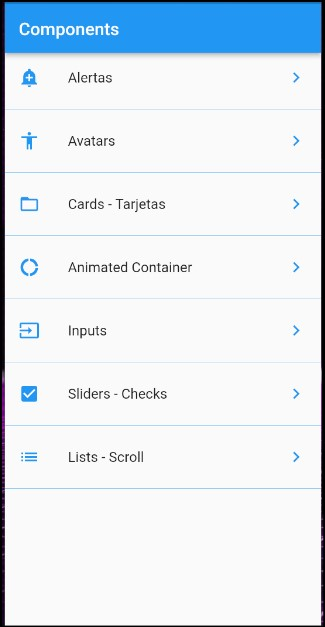

# flutter_components

A flutter project that implements some of the Widgets most used in flutter:
- Alerts
- Avatars
- Cards
- Animated Containers
- Inputs
- Sliders
- Checks
- List
- Scroll and Infinite Scroll

    

